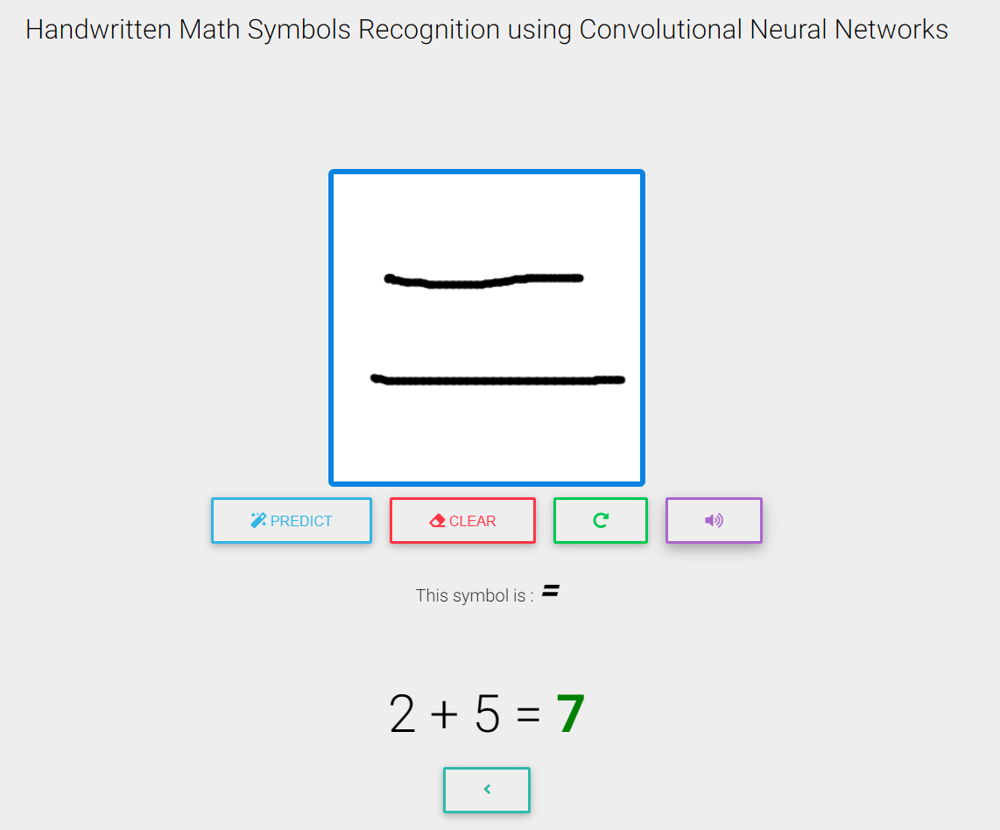

# Getting Started

This repository containts the deployed version of [This model](https://github.com/Otman404/Mathematical_Expressions_Recognition) using [Flask](http://flask.pocoo.org/). It can detect and classify math symbols aswell as greek letters and alphabets ...


# Basic Usage

Draw a symbol on the drawing zone and click 'Predict' to get the result, you can also perform basic math operations like addition , subtraction ... by Drawing for example : '2' then '+' then '1' , and when you draw '=' you automatically get the result.

# Interface


## operations




## Running Locally


```sh
$ git clone https://github.com/Otman404/deployed_math_symbols_classification_flask
$ cd app

$ export FLASK_APP=app.py
$ flask run --host=0.0.0.0
```

Your app should now be running on [localhost:5000](http://localhost:5000/).

